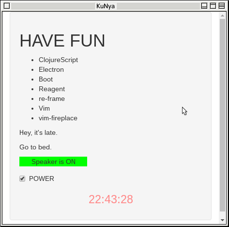

# KuNya
This is a minimal Electron application featuring:

- `ClojureScript` for language
- `Boot` for build tool
- `Reagent` for view engine
- `re-frame` for framework
- `Vim` for editor
- `vim-fireplace` for interactive programming

The project is based on [martinklepsch/electron-and-clojurescript](https://github.com/martinklepsch/electron-and-clojurescript). See also [his awesome YouTube video](https://youtu.be/tBnu2JmK4p0). He uses emacs though.

# Setup
## `~/.boot/boot.properties`

    BOOT_CLOJURE_NAME=org.clojure/clojure
    BOOT_CLOJURE_VERSION=1.8.0
    BOOT_VERSION=2.6.0

This is for JVM on which boot runs. Also can be placed on the project root directory.

## `~/.boot/profile.boot`

    (require 'boot.repl)

    (swap! boot.repl/*default-dependencies*
           concat '[[cider/cider-nrepl "0.13.0"]])

    (swap! boot.repl/*default-middleware*
           conj 'cider.nrepl/cider-middleware)

This is only for vim-fireplace which uses cider-nrepl to access nRepl. And it makes slow down `$ boot repl` to start from commmand line.

# Usage

At first, start a bunch of boot tasks for development:

    $ boot dev

Then open `src/cljs/kunya/ui.cljs` with Vim and do `:Piggieback (adzerk.boot-cljs-repl/repl-env)`. Vim looks like freezing, but it's actually waiting for connection from browser. So start electron on the other terminal:

    $ electron target/

Now vim-fireplace is ready, you can do `cpp`, `K`, `:Eval (js/alert "hoge")`, etc... `]<C-D>`(jump to the definition) looks fine, but unfortunately it opens boot's internal cache files. No problem with `]d` though.

When something is wrong with vim-fireplace, do `:Piggieback!` to close latest cljs repl, then `:Piggieback (adzerk.boot-cljs-repl/repl-env)` again. Maybe you need to reload/restart electron.

By the way, my understanding about the dev environment above is:
- there are clojure nRepl server, cljs repl server, and cljs repl client
- `$ boot dev` starts clojure nRepl server(cljs-repl task)
- boot-cljs-repl starts cljs repl server with help of Piggieback
- Piggieback is a clojure nRepl middleware to change clojure nRepl to cljs repl(or run cljs repl server on top of clojure nRepl server)
- vim-fireplace starts cljs repl client
- with a browser(or electron) running, vim-fireplace chooses bRepl(browser repl) as cljs repl client
- without it, Rhino(cljs nRepl written in Java) will be chosen
- the bRepl provided by boot-cljs-repl uses Weasel, which uses websocket for communication between browser and repl(where as standard bRepl uses long-polling)

# Packaging

Using [electron-packager](https://github.com/electron-userland/electron-packager):

    $ boot release
    $ electron-packager release/ --platform=linux --arch=x64 --version=1.3.2

`--version` indicates electron version.
